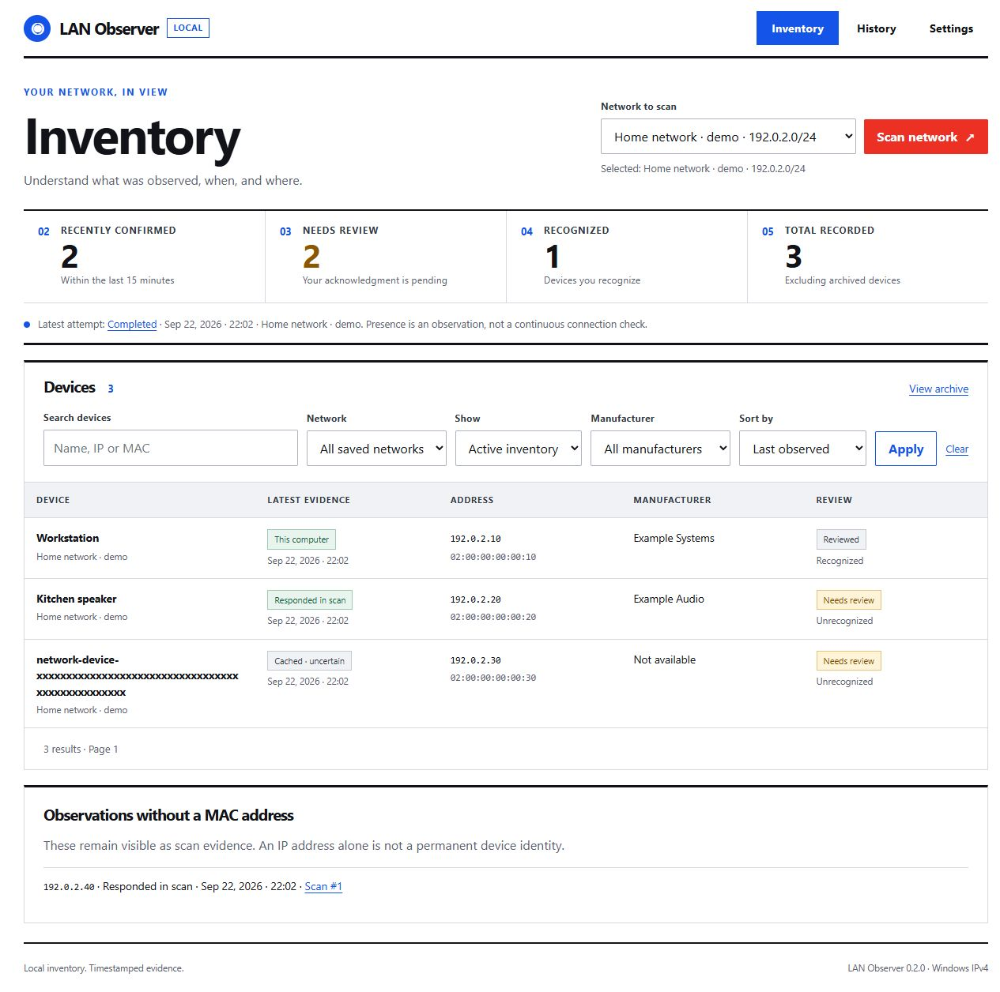

# LAN Observer

A Windows-first, local network inventory built with Python, Flask and SQLite. Version 0.2.0 replaces the original prototype's binary online/offline model with timestamped observations, explicit network selection, and background scan jobs.



## Run the Windows package

Extract the entire `LANObserver-0.2.0-windows-x64.zip` folder and run `LANObserver.exe`. Keep its `_internal` folder next to the executable. Python does not need to be installed for this package. The launcher opens `http://127.0.0.1:5000` in your browser. Keep its console open while using the app; Ctrl+C stops it.

The package is unsigned and is a local beta build, not a signed installer. No autostart entry or background service is installed. App data is separate from the extracted folder. Removing the package does not remove your inventory.

```powershell
.\LANObserver.exe --port 5050
.\LANObserver.exe --data-dir 'C:\MyLocalData\LANObserver' --no-browser
```

## Run from source

Use Windows and Python 3.12 or newer (local verification used Python 3.12; CI includes 3.13).

```powershell
py -3.12 -m venv .venv
.\.venv\Scripts\python.exe -m pip install -r requirements.txt
.\.venv\Scripts\python.exe app.py
```

This working folder also has a tested `.venv-dev` environment. `Start-LANObserver.ps1` uses it when present and otherwise uses `.venv`:

```powershell
.\Start-LANObserver.ps1
```

Normal use runs Waitress on loopback with debug and the reloader disabled. The database and local session key live in `%LOCALAPPDATA%\LANObserver`, independent of the current working directory. Override with `--data-dir` or `LAN_OBSERVER_DATA_DIR`. Use a local data folder, not a shared/synchronized SQLite file.

## First use and existing inventory

1. Open **Settings**, select a connected adapter, and give the network a name. The adapter address/prefix is shown before scanning. You can select a smaller IPv4 CIDR range inside it; scanning is capped at 1,024 hosts.
2. Return to **Inventory**, choose that network, and select **Scan network**. Progress, warnings, cancellation, and retry are available on the scan page.
3. Open a device to name it, add searchable notes/tags, recognize it, mark it reviewed, or archive it. Recognition and review are independent.
4. To retain data from the original app, use **Settings → Import your original inventory** and select the old `devices.db` path. The importer reads the original without modifying it, keeps a consistent backup, normalizes MACs, and retains every original record. Duplicate names/recognition disagreements are flagged for review.
5. Imported devices initially belong to **Legacy inventory · unassigned**. Open a device and **Link to network** to associate it deliberately. If the target already contains its MAC, the original is kept in the archive and conflicts appear in its timeline. The importer does not invent old scan history or current presence.

Each saved network is a separate inventory. Adapter GUID, profile, gateway and prefix guard against silently using a saved scope after moving networks. Two physically different networks with indistinguishable adapter/profile/gateway/prefix details still need separate saved network entries and explicit selection. MACs can be randomized or spoofed; this is an inventory aid, not proof of identity or safety.

## What the observations mean

| Label | Meaning |
| --- | --- |
| Responded in scan | A successful IPv4 ICMP response was recorded in the past 15 minutes. |
| This computer | The selected local adapter was present in the scanned scope. |
| Cached · uncertain | Windows had a neighbor entry; this is not a fresh response. |
| Not observed in scan | No matching observation in the covered range of a completed scan. This does not prove disconnection. |
| Stale observation | The evidence is older than 15 minutes or its time is unknown. |
| Historical observation | Imported legacy data, without current reachability evidence. |

Responses with no MAC remain visible as scan observations rather than being discarded or permanently identified by an IP address. Failed/canceled scans preserve the prior inventory. Partial scans can add positive evidence but do not infer absence. Current hostname/vendor lookup failures preserve earlier useful values.

The Windows scanner uses the ICMP API with an explicit source address, reads neighbors for the selected interface, and bounds network work. Discovery has a 30-second submission budget; outstanding probes can use their remaining 800ms timeout. Neighbor-table reading has a 10-second timeout. Optional DNS enrichment has a separate 10-second submission budget and at most 3 seconds per active child process. Cancellation stops new work; active calls finish within these bounds. A scan's total duration can include all these phases.

## History, scheduling and data

- Search by name, hostname, IP, MAC, manufacturer, or notes. Filter by network, recognition, review, archive state, or manufacturer. Sort by name, numeric IP, or most recent observation. Inventory pages contain at most 50 device rows.
- Scan history includes outcomes, warnings, evidence and changes. Comparisons use retained observations from completed scans; they do not imply exact connection intervals or uptime.
- Scheduling defaults to off. Available intervals are 5, 15, 30 or 60 minutes, for one saved network while the app is running. There is one active scan at a time. Missed intervals after sleep are not replayed; interrupted jobs are marked after restart.
- Detailed observations are retained for 30, 90 or 365 days (default 90). The latest snapshot per network, device summaries, scan records and change events are retained. Old detail rows are pruned after scans; summary/history storage can still grow over long use.
- Backups use SQLite's consistent backup API. Restore accepts this schema version and makes a pre-restore backup first. Scheduling is disabled after restore. JSON exports include private device and network data.
- Local application logs rotate at 1 MB with three backups. The **Redacted diagnostics** endpoint contains version, schema and aggregate scan state only.

## Privacy and local request protection

Inventory stays on this computer. There is no account, telemetry, cloud backend, automatic vendor-list download, or device-identifier vendor query. Probes are sent only to the explicitly selected directly attached IPv4 range. Optional reverse DNS uses the computer's configured resolver, which may send DNS queries outside the LAN; disable it in Settings if undesired.

Manufacturer lookup uses a user-imported UTF-8 IEEE OUI CSV (`Assignment` and `Organization Name` columns). No list is bundled or redistributed. Obtain/update the list separately; scanning remains useful without it.

The service binds to `127.0.0.1`. Requests validate local hosts and require a session-bound CSRF token for every mutation. Non-opaque origins are checked; opaque/missing origins still require the token. Do not expose this service through a public interface or reverse proxy: remote authentication and TLS deployment are outside the current supported scope. Local users/processes with access to your files can read the unencrypted inventory.

## Development and packaging

```powershell
.\.venv-dev\Scripts\python.exe -m unittest discover -s tests -v
.\.venv-dev\Scripts\python.exe scripts\demo.py
.\.venv-dev\Scripts\python.exe -m pip install build setuptools wheel pyinstaller pip-audit
.\.venv-dev\Scripts\python.exe -m pip_audit -r requirements.txt
.\.venv-dev\Scripts\python.exe -m build
.\scripts\build_windows.ps1
```

The demo binds to port 5057, uses synthetic documentation-range devices in `.runtime/demo`, and never scans your LAN. Use it for browser QA, not as the normal launcher.

The package exposes `create_app(config)` with injectable interface/scanner providers for tests. The standard launcher owns the OS process lock, scheduler recovery and worker shutdown. A custom WSGI deployment must implement equivalent single-instance lifecycle management; blindly spawning multiple WSGI workers is unsupported.

See [implementation status](IMPLEMENTATION_STATUS.md) for current test evidence and remaining release-validation limits. The [visual audit](VISUAL_AUDIT.md) tracks the follow-up UI fixes. [AUDIT.md](AUDIT.md), [BUG_LOG.md](BUG_LOG.md), and [OVERHAUL_PLAN.md](OVERHAUL_PLAN.md) retain the original findings and design rationale. `audit/reproduce.py` applies to the old `d3c662c` baseline; current correctness checks are in `tests/`.

Supported scope is Windows IPv4 discovery on networks you own or are authorized to inspect. IPv6, packet capture, bandwidth measurement, vulnerability scanning, router control, remote multi-user access, and a signed installer are not part of this version. No repository license has been selected; choose one before public distribution under an open-source license.
