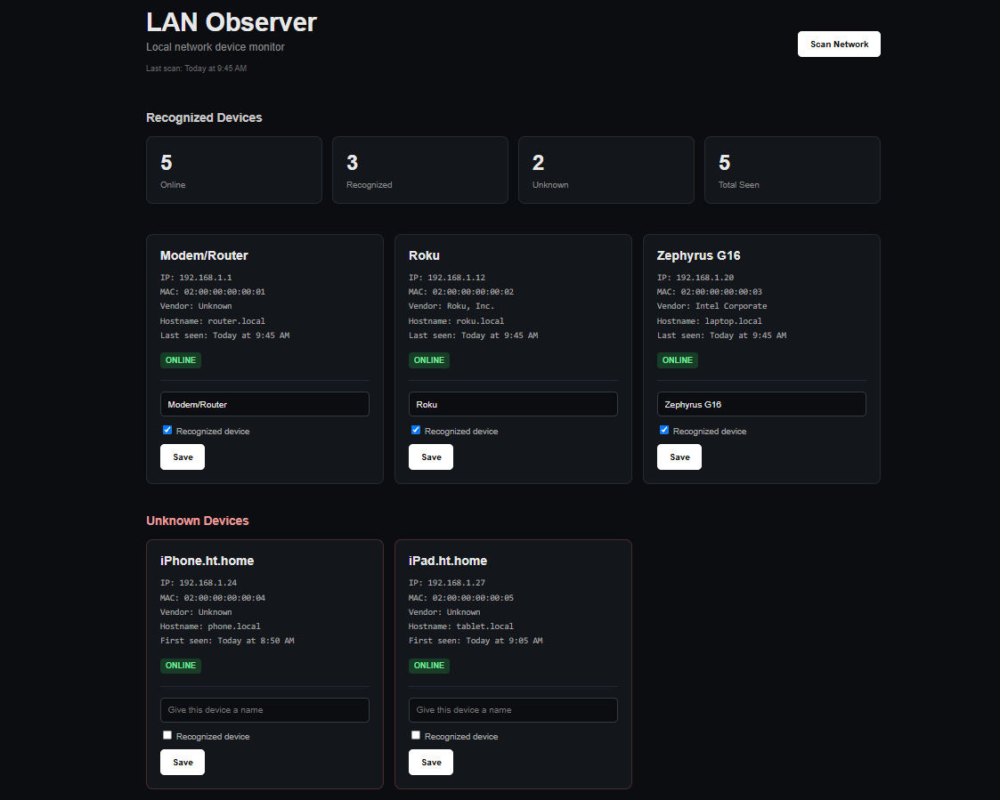

# LAN Observer

LAN Observer is a lightweight local network monitoring dashboard built with Python and Flask. It scans devices on a local network, identifies them using IP addresses, hostnames, MAC addresses, and manufacturer information, and keeps track of previously discovered devices using SQLite.



## Features

* Scan devices on the local network
* Detect IP addresses and hostnames
* Detect MAC addresses
* Identify hardware vendors using MAC address data
* Track online and offline devices
* Store previously discovered devices with SQLite
* Mark devices as recognized or unknown
* Assign custom names to devices
* Detect previously unseen devices
* Track first-seen and last-seen timestamps
* Display network statistics
* Track when the network was last scanned
* Responsive dark dashboard interface

## Tech Stack

* Python
* Flask
* SQLite
* HTML
* CSS
* JavaScript
* `mac-vendor-lookup`

## Installation

### 1. Clone the repository

```bash
git clone https://github.com/nevchr/lan-observer.git
cd lan-observer
```

### 2. Create a virtual environment

#### Windows PowerShell

```powershell
python -m venv .venv
.\.venv\Scripts\Activate.ps1
```

#### macOS / Linux

```bash
python3 -m venv .venv
source .venv/bin/activate
```

### 3. Install dependencies

```bash
pip install -r requirements.txt
```

## Running LAN Observer

Start the Flask application:

```bash
python app.py
```

Then open:

```text
http://127.0.0.1:5000
```

in your browser.

Click **Scan Network** to discover devices on your local network.

## How It Works

LAN Observer scans the local IPv4 subnet and combines ping responses with the system ARP table to discover devices.

For each discovered device, LAN Observer attempts to collect:

* IP address
* MAC address
* Hostname
* Hardware vendor
* Online status

Device information is stored locally in an SQLite database so that devices can still be recognized after they disconnect from the network.

MAC addresses are used as persistent device identifiers because local IP addresses may change over time.

## Privacy

All scanning and device information remain local to the computer running LAN Observer.

The local `devices.db` database is excluded from version control and is not uploaded to the repository.

Some devices may use randomized or private MAC addresses, which can prevent manufacturer identification.

## Current Limitations

* Designed primarily for IPv4 `/24` local networks
* Device discovery depends partly on ICMP ping responses and the operating system ARP cache
* Private/randomized MAC addresses may appear with an unknown manufacturer
* Currently optimized for Windows
* Does not perform vulnerability scanning or inspect network traffic

## Future Ideas

Possible future improvements include:

* Device filtering and sorting
* Scan history
* Device connection history
* Automatic scheduled scans
* Search
* New-device notifications
* Raspberry Pi deployment
* Network activity charts
* Additional network interface information

## Disclaimer

LAN Observer is intended for monitoring networks that you own or have permission to access.
